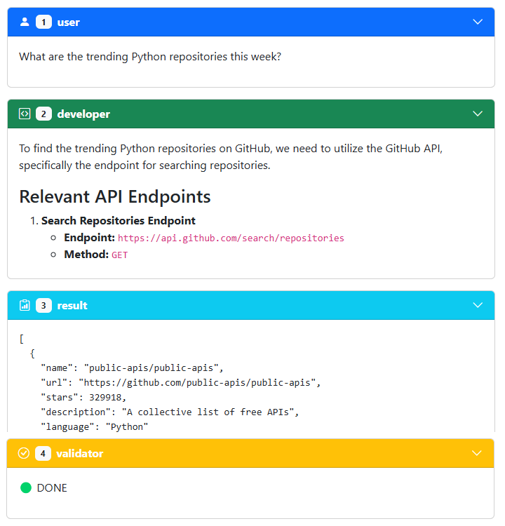

# API Agent

API Agent is an interactive web application that allows users to query APIs through natural language. It translates user questions into API calls, fetches real-time data, and presents the results in a user-friendly format.

## Features

- **Natural Language Interface**: Ask questions in plain English to interact with APIs
- **Multiple API Support**: Connect to GitHub, GitLab, StackOverflow, Google Workspace, Jira, and more
- **Real-time Data**: Access up-to-date information from various platforms
- **Code Generation**: Automatically generates and executes JavaScript code for API calls
- **Result Validation**: Verifies that the results answer the original question
- **Dark/Light Mode**: Supports theme switching for comfortable viewing
- **Token Management**: Securely store API and OAuth tokens for authenticated requests

## Usage

1. Enter your question in the input field (e.g., "What are the trending Python repositories this week?")
2. Click "Submit" to process your request
3. View the step-by-step process:
   - Developer analysis of required API endpoints
   - Generated code to fetch the data
   - Results from the API call
   - Validation of the results

### Example Questions

- What are the most starred JavaScript repositories on GitHub?
- What are the most recent questions about React on StackOverflow?
- Who are the top contributors to the TensorFlow repository?
- What are the trending Python repositories this week?
- What are the most upvoted JavaScript questions on StackOverflow?
- List my unread Gmail messages
- What events do I have tomorrow?

## Setup

### Prerequisites

- Modern web browser (Chrome, Firefox, Safari, Edge)
- API tokens (optional, but recommended for higher rate limits):
  - [GitHub Token](https://github.com/settings/tokens)
  - [GitLab Token](https://docs.gitlab.com/ee/user/profile/personal_access_tokens.html) and your [GitLab URL](https://docs.gitlab.com/ee/api/index.html#gitlab-api-endpoint-url) if self-hosted
  - [StackOverflow Token](https://stackapps.com/apps/oauth/register)
  - [Google OAuth Token](https://developers.google.com/oauthplayground/)
  - [Jira Token](https://id.atlassian.com/manage-profile/security/api-tokens)
  - [Google Custom Search API Key](https://developers.google.com/custom-search/v1/introduction)
  - [SerpApi Key](https://serpapi.com/manage-api-key)
  - [OpenRouter API Key](https://openrouter.ai/settings/keys)

### GitLab API Usage

The GitLab REST API lets you list projects, inspect issues and merge requests, and track activity.
Use `/projects` to list repositories, `/projects/:id/repository/commits?since=<date>` to see recent commits, and `/users/:username/events` to view user actions.

### Local Setup

1. Clone this repository
2. Open `index.html` in your browser
3. Log in to LLM Foundry when prompted
4. (Optional) Add your API tokens in the "API Tokens" section
5. (Optional) Expand the APIs you need and enter tokens if required

## Deployment

The application can be deployed to any static web hosting service:

1. Upload all files to your web server
2. Ensure CORS is properly configured for API requests
3. Set up proper authentication for the LLM Foundry service

## Technical Details

### Architecture

API Agent uses a client-side architecture with the following components:

- **Frontend**: HTML, CSS (Bootstrap), and JavaScript
- **LLM Integration**: Connects to LLM Foundry for natural language processing
- **API Connector**: Dynamically generates and executes JavaScript to call external APIs
- **Result Renderer**: Formats and displays results using lit-html and marked

### Dependencies

- [Bootstrap 5.3.3](https://getbootstrap.com/) - UI framework
- [lit-html 3](https://lit.dev/) - HTML templating library
- [asyncLLM 2](https://npmjs.com/package/asyncllm) - Streaming LLM responses
- [marked 13](https://marked.js.org/) - Markdown parsing
- [highlight.js 11](https://highlightjs.org/) - Syntax highlighting

## License

[MIT](LICENSE)
